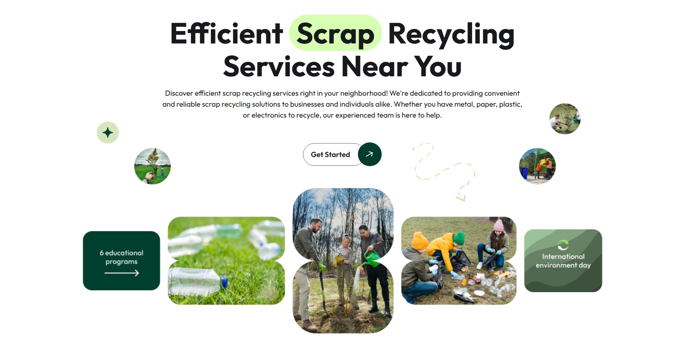

# ♻️ Eco Scrap – Efficient Scrap Recycling Landing Page

**Eco Scrap** is a responsive landing page built with [Astro](https://astro.build), designed to promote efficient and reliable scrap recycling services. The project serves as a front-end practice focused on layout, semantic HTML, accessibility, and component-based development using modern web technologies.



## 🔧 Tech Stack

- **Astro**
- **Tailwind CSS**
- **Responsive Design**
- **Accessible HTML structure**
- **SEO-friendly metadata**

## 📌 Features

- Clean and minimalistic hero section
- Mobile-first responsive layout
- SEO-optimized meta tags (Open Graph + Twitter)
- Modular and reusable components
- Designed with performance and clarity in mind

## 🚀 Purpose

This project is part of a personal initiative to improve front-end layout skills using Astro and Tailwind CSS. It simulates a real-world landing page for a recycling service business.


## 📁 Project Setup

```bash
# Install dependencies
pnpm install

# Start development server
pnpm run dev

# Build for production
pnpm run build

# Preview production build
pnpm run preview
